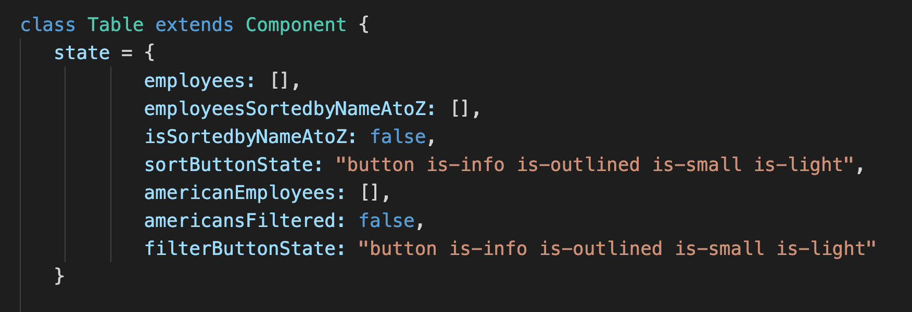
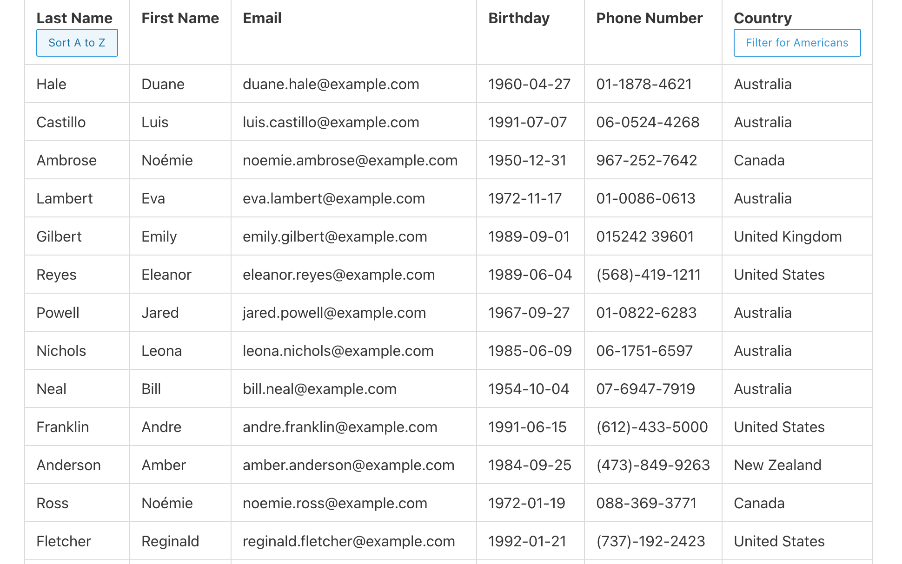
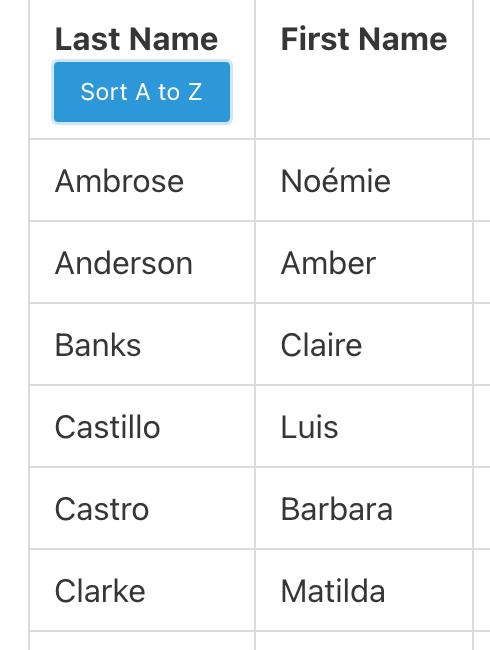
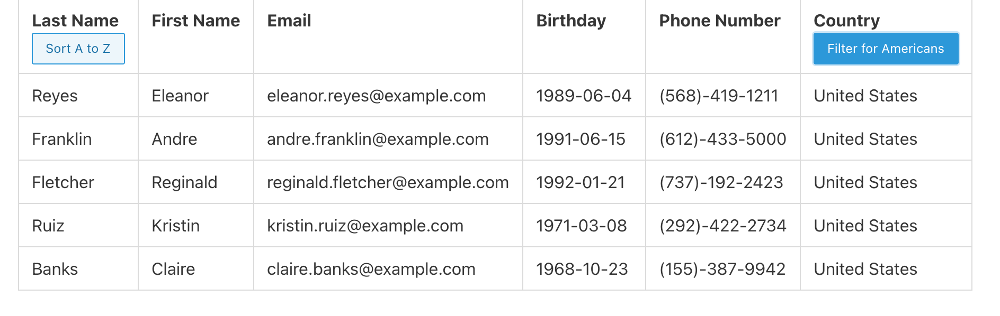

# React Employee App    
  

  ## Table of Contents  
  1. [Description](#description) 
  2. [Installation](#installation) 
  3. [Usage](#usage)
  4. [Screenshots](#screenshots)
  5. [Licensing](#licensing)
  6. [Challenges](#challenges) 
  7. [Additional Questions](#additional-questions?)

  ---  

  ## Description:  
  For this project, we were tasked with ccreating a table of employees that is rendered using React and that can be sorted and filtered using React rendering.  

  ---  

  ## Installation:  
  To access the app, visit https://rhubble1987.github.io/react-employee-app/  

  ---  

  ## Usage:  
  Once the page loads, you will be presented with a table of employees. The table lists each employee's last name, first name, email address, date of birth, phone number, and country. To sort employees alphabetically by last name, click the 'Sort A to Z' button under Last Name. To remove the sorting, simply click the button again. To filter for only employees based in the United State, click the 'Filter for Americans' button under Country. To show all employees again, click the button a second time.  

  --- 

  ## Screenshots:

  

  

  

  

  ## Licensing:  
  Public Domain - App can be shared and modified however you want!

  ---  

  ## Challenges:  
  The biggest challenge with this app was simply familiarizing myself with React and grapsing the concept of state. Once I gained a good understanding of this and learned the syntax, putting the app together was pretty straightforward.  

  ---  
  ## Additional Questions?  
  If you have any other questions, you can contact the project creator at:  
  GitHub username: rhubble1987  
  Email address: rhubble1987@gmail.com